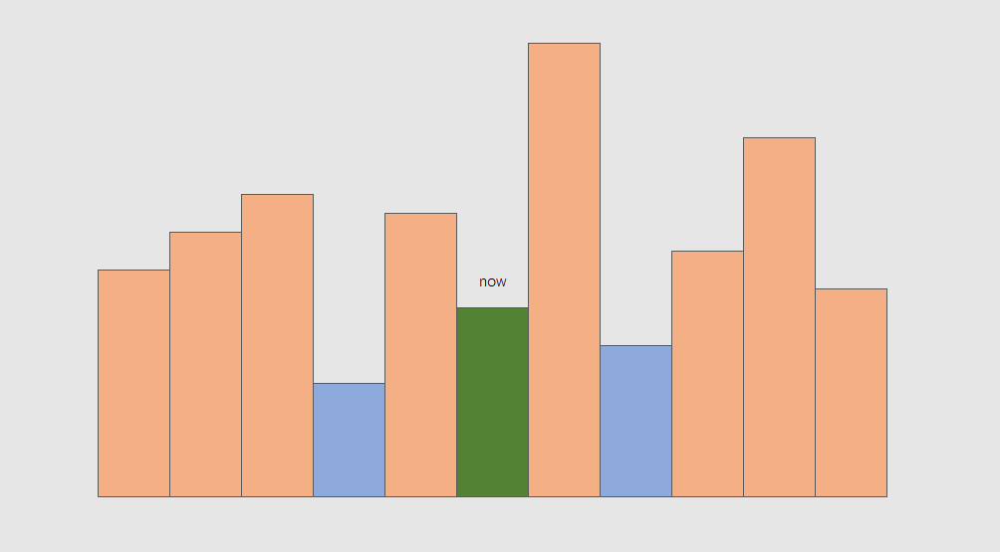
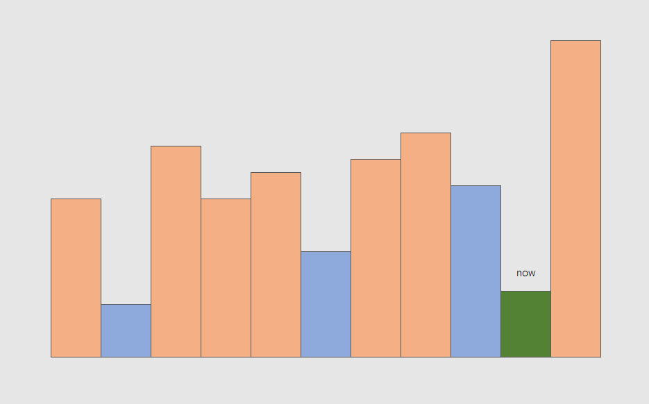

# 单调性

先看问题，再来总结

## 单调栈

[leetcode.P84](https://leetcode.cn/problems/largest-rectangle-in-histogram/description/)

> 给定 n 个非负整数，用来表示柱状图中各个柱子的高度。每个柱子彼此相邻，且宽度为 1 。
> 求在该柱状图中，能够勾勒出来的矩形的最大面积。

这题关键在于分析这个图：

假如枚举以每个矩形为天花板所能取到的最大面积，问题就转换为如何快速找到左侧和右侧的**第一个**比当前矩形更矮的矩形

线性序列找第一个大于/小于当前值的值，立刻想到单调栈，问题在于

1. 该维护递增栈还是递减栈
2. 能不能扫一次就得到左右的信息

首先看看如果维护一个递减栈，当迭代到 now 时，栈中有什么值

显然栈里是一个递减序列，如果用语言来描述，栈 `stk` 满足：

- 栈中任意一个元素 `x`，其下方的元素 `y` 是 `x` 左侧的第一个更大值

显然这和我们要维护的信息是相悖的，譬如上图中，到 now 时左侧蓝色矩形会被直接丢弃

我们再看维护一个递增栈，对称地可以知道，栈中元素应该满足下方元素是上方元素左侧的第一个更小值，这正是我们要求的

**因而此题应该维护一个递增栈**

再看第二个问题，能不能在维护栈的过程中同时得到右侧第一个更小值

这个问题看似不那么重要，只是一种可选的优化，然而其也蕴含了重要的性质。

答案是可以。

考虑递增栈的更新过程，蓝色代表栈中元素，现在迭代到绿色 now：

则 now 将挤掉栈中的顶部两个蓝色矩形，

综上，单调栈（递增栈）具有以下性质：

1. 栈中元素 `x` 下方是 `y`，则 `y` 是 `x` 左侧的**第一个**更小元素
2. 迭代到 `x` 后，`x` 一定是栈顶元素
3. 迭代到 `x` 时，`x` 挤掉了 `y, z`，则 `x` 一定是 `y, z` 的右侧**第一个**更小元素，并且一定不是其他任何元素的右侧第一个更小元素

## 单调队列

