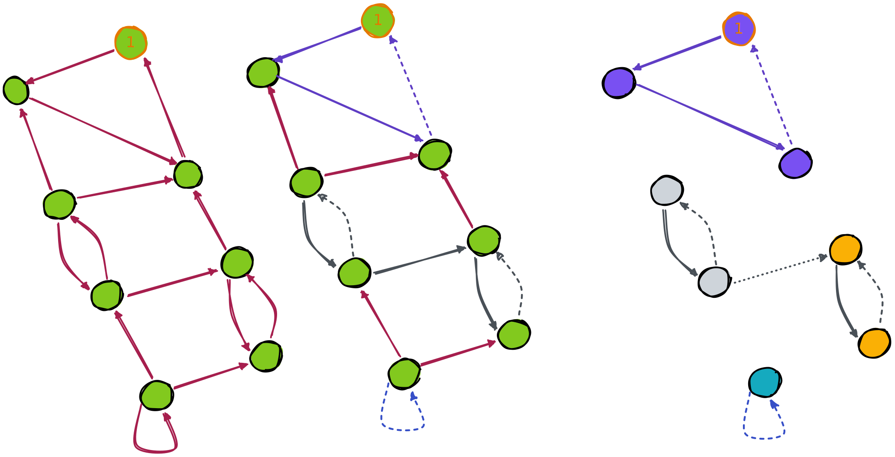
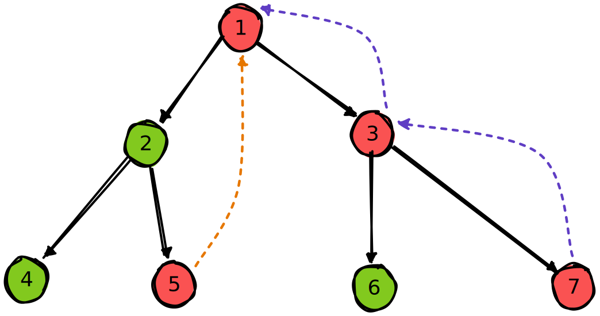

# tarjan

理解 tarjan 和缩点

> 写了个证明在知乎：[Tarjan scc 证明](https://zhuanlan.zhihu.com/p/629370905)

## tarjan 求强连通分量

理解这个过程的关键在于以 dfs 搜索树和搜索栈的视角来看待图遍历

众所周知 dfs 一个图的过程可以看作一棵树

---

- 问：如果树的一个节点 $a$ 可以延申一条边到 $b$，$b$ 是 $a$ 的祖先，说明什么
- 答：说明 $7$ 和 $3$ 位于同一个强连通分量

---

- 问：如果 $b$ 不是 $a$ 的祖先，说明什么
- 答：看情况，$11$ 能连 $7$ 说明 $7$ 和 $11$ 在同一个强连通分量，而 $9$ 能连 $5$ 什么也说明不了

---

- 问：是什么造成了这种差异
- 答：因为 $7$ 与 $3$ 强连通，$3$ 是 $11$ 的祖先

---

- 问：强连通说明什么
- 答：$a$ 和 $b$ 强连通，从某种意义上可以将 $a$ 与 $b$ 看作同一个点

---

- 问：然后呢
- 答：所以 $7$ 实际上可以看作就是 $11$ 的祖先

---

- 问：有个问题，如果 dfs 的过程中，先发现 $11$ 能连接 $7$，然后才发现 $7$ 能连 $3$，可怎么办
- 答：这种情况不会出现

---

- 问：为什么
- 答：因为如果 $11$ 和 $3$ 在同一个强连通分量，那么当 $11$ 还在搜索栈里的时候，一定有办法碰到 $3$

---

- 问：也就是说不可能出现 $11$ 没发现 $3$ 跟自己在同一个强连通分量里，反而要通过后续的 $7$ 来间接发现的情况
- 答：对

---

- 问：所以当看到 $9$ 能碰到 $5$ 的时候直接无视就好了
- 答：对。因为如果 $9$ 能碰到 $5$，但 $5$ 又不在 $9$ 的子树里，这说明 $5$ 已经遍历完了。
  这也说明 $9$ 不在 $5$ 的子树里。所以假如 $5$ 能与 $9$ 强连通，那么唯一的可能是他们都至少与 $2$ 强连通，$2$ 是他们的公共祖先

---

- 问：所以即使 $a$ 和 $b$ 强连通，他们也有可能不在对方的子树里
- 答：对。可以想象这样一种情况：$a$ 和 $b$ 强连通，但他们之间仅仅由一个节点 $c$ 连接，没有其他互相到达的路径。如果此时 dfs 不巧以 $c$ 作为二者的祖先来遍历，那么由于每个节点都只在 dfs 中出现一次，$a$ 和 $b$ 不能通过 $c$ 来互相抵达

---

- 问：是搜索剪枝导致它这样的
- 答：是的

---

- 问：那假如 $5$ 和 $9$ 强连通，则他们一定都与 $2$ 强连通吗？我的意思是，他们有没有可能通过其他节点来连接起来
- 答：可以分情况解答：
  1. 若 $9$ 和他们其他的公共祖先，比如 $1$ 强连通，那么 $9$ 一定和 $2$ 也强连通，这很显然
  2. 若 $9$ 和 $5$ 通过 $4$ 强连通起来，那么在 dfs 的过程里，$4$ 应该是 $5$ 和 $9$ 的公共祖先，这与现在的情况矛盾

---

- 问：我再想想 #沉淀
- 答：如果从结果倒推，当 dfs 接触到一坨强连通分量时，碰到的第一个节点 $a$ 就应该是该强连通分量里其他所有节点的祖先。这很自然，因为从 $a$ 一定能到达其余所有节点

---

---

- 问：也就是说，从直观上来看，一个强连通分量在 dfs 树上一定也是连通的
- 答：是的，只要 dfs 搜索树长成了这样，并且 $2$ 和 $1$ 不连通，那么就算 $5$ 跟 $1, 3, 7$ 连出了花，他们也一定不连通

---

- 问：因为如果 $5$ 和 $1$ 连通，那么他们一定都和 $2$ 连通。同样如果 $5$ 和 $3$ 连通，则他们要么一方在另一方的子树里，要么有连通的公共祖先
- 答：对

---

- 问：是不是如果 $a$ 和 $b$ 在不同的子树，但他们连通，则他们一定有且仅有唯一的公共祖先
- 答：并不，比如他们可以和最小公共祖先的父节点也连通

---

