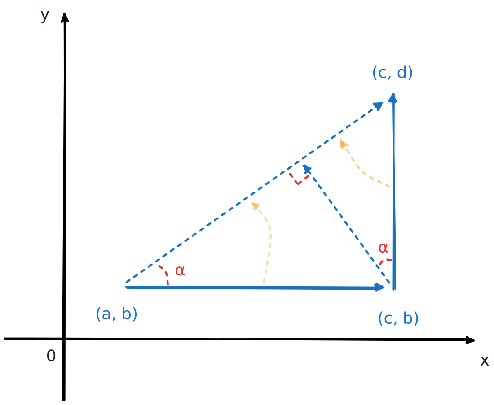

# 连续，偏导，可微

- 二元函数 $f(x, y)$ 在 $(x_0, y_0)$ 处连续，啥都推不出来，例如：

$$
f(x, y)=\sqrt[4]{x^2+y^2}
$$

在 $(0, 0)$ 连续，偏导不存在，不可微

- 偏导存在并连续，则必可微

当全微分指向从 $(a, b)$ 到 $(c, d)$ 方向时，其值为该方向的方向导数

如果 $(a, b)$ 点处偏导数存在且连续，则 $(a, b)$ 附近有一块包含 $(c, b)$ 的邻域，满足 $f_Y(c, b)\to f_Y(a, b)$

在无穷小的情况下，有如下近似：

$$
\begin{aligned}
f'_{(a, b)\to(c, d)}(a, b)
&= \lim_{(c, d)\to (a, b)} \frac {f(c, d) - f(a, b)} {||(c, d) - (a, b)||}\\
&= \lim_{(c, d)\to (a, b)} \frac {f(c, d) - f(c, b) + f(c, b) - f(a, b)} {||(c, d) - (a, b)||}\\
&= \lim_{(c, d)\to (a, b)} \frac {f(c, d) - f(c, b)}{||(c, d) - (c, b)||} \frac {||(c, d) - (c, b)||} {||(c, d) - (a, b)||}  + \frac {f(c, b) - f(a, b)} {||(c, b) - (a, b)||} \frac {||(c, b) - (a, b)||}{||(c, d) - (a, b)||} \\
&= \lim_{(c, d)\to (a, b)} f_Y(c, b) \frac {||(c, d) - (c, b)||} {||(c, d) - (a, b)||} + f_X(a, b)\frac {||(c, b) - (a, b)||}{||(c, d) - (a, b)||}\\
&= f_Y(a, b) \sin \alpha + f_X(a, b) \cos \alpha\\
\end{aligned}
$$

于是该方向的方向导数能用偏导线性表示

如果所有方向的方向导数都能用偏导数来<u>**同样的**</u>线性表示，那么称之为可微

用一个向量来表示这样的方向导数，称为该函数的全微分

上面这个<u>**同样的**</u>不太好描述清晰，举例而言，二元函数，也就是三维空间上的函数，其全微分应该处于由两个偏导数所张成的切平面上

从切平面上逼近切点，距离函数的差值是距离点的度量的高阶无穷小

换言之切点附近可以用切面去近似这个函数

如果用 Jacobi 行列式 $J$ 则更好说明。可微定义为：

$$
\lim_{\overrightarrow{h} \to \overrightarrow{(0, 0)}} \frac {||f(\overrightarrow{x}) - f(\overrightarrow{x} + \overrightarrow{h})|| - ||J(\overrightarrow{h})||}{||\overrightarrow{h}||} = 0
$$

其中 $J(\overrightarrow{h})$ 就代表了全微分，相当于切面，而左边则是方向导数

**注意** 上方推导过程中，直到最后一步，都不要求 $x, y$ 垂直。从概念上看，只需两个偏导方向能张成所需空间即可

例如：已知 $f(x, y)$ 可微，且

$$
f(x+1, \ln(x+1)) = (1+x)^3 + x \ln (1+x)(x+1)^{\ln(1+x)}\\
f(x^2, x-1) = x^4 e^{x-1} + (x-1)(x^2-1)x^{2(x-1)}
$$

求 $df(1, 0)$

- 可微不一定偏导连续

在一元函数上类比这句话，即可导不一定导数连续，这在一元函数上也是对的，如：

$$
\begin{aligned}
&f(x) = \begin{cases}
x^2\sin{\frac 1 x}, &\text{others}\\
0, &(0, 0)
\end{cases}\\
\to&f'(x)=\begin{cases}
2x\sin{\frac 1 x} - \cos{\frac 1 x}, &\text{others}\\
0, &(0, 0)
\end{cases}
\end{aligned}
$$

其中

$$
\begin{aligned}
f'(0)
&=\lim_{x\to 0} \frac {x^2 \sin {\frac 1 x} - 0} {x - 0}\\
&=\lim_{x\to 0} x \sin {\frac 1 x}\\
&= 0
\end{aligned}
$$

也即 $f(x)$ 在 $x=0$ 处可导，并且导函数等于 $0$，然而在 $x=0$ 点处 $f'(x)$ 其实又是震荡的，并不连续

将这个例子扩展到二元函数

$$
f(x, y) = \begin{cases}
(x^2 + y^2) \sin {\frac 1 {x^2 + y^2}}, &\text{others}\\
0, &\text{(0, 0)}
\end{cases}
$$

就得到了可微但偏导数不连续的例子
