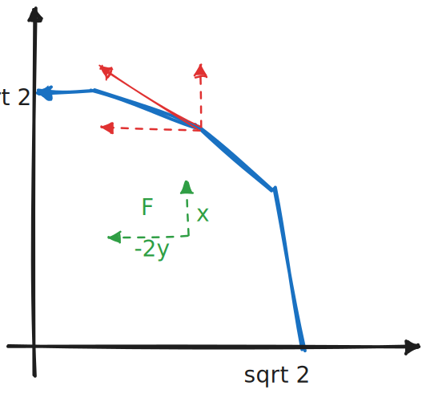
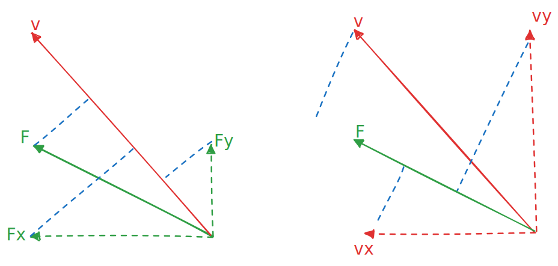

# 曲线积分

设 $L$ 为正向圆周 $x^2 + y^2 = 2$ 在第一象限中的部分，则曲线积分 $\int_L x dy - 2y dx$ 的值为

本质上，第一类和第二类积分没有什么区别。

第二类积分说是向量微积分，但实际上积出来仍然是一个实数

如果说第一类曲线积分是对一条绳子的密度进行积分来得到质量，那么第二类曲线积分同样如此，只不过它的每一点的密度 $m(x, y)$ 由曲线方向 $v$ 和向量场 $F$ 共同决定，即

$$
\begin{aligned}
\int_L xdy - 2ydx
&= \int_L m ds\\
&= \int_L Fv ds
\end{aligned}
$$

在本例中，向量场 $F(x, y) = (-2y, x)$，绳子每一点的密度 $m$ 为 $F$ 到曲线方向上的投影长度，其值为点积 $Fv$：

如果把 $Fv$ 分解到同一组正交的基向量上，则 $Fv = (F_x, F_y)(v_x, v_y) = F_xv_x + F_yv_y$

这也是第二类曲面积分总是以 $\int Pdx + Qdy$ 出现的原因，其有一种基本的计算方法是换元到参数方程：

$$
\int Pdx + Qdy = \int (P\frac {dx} {dt} + Q \frac {dy} {dt})dt
$$

但其实有时候不换元也能做，尽管在能简化计算的情况下通常都换元计算

比如本题是个圆周，所以可以极坐标换元：

$$
\begin{aligned}
\int xdy - 2ydx
&=\int_0^{\pi /2} 2 \cos t \cos t + 4 \sin t \sin t dt\\
&=\int_0^{\pi /2} 2 + 2 \sin^2 t dt\\
&= \pi + 2 \int_0^{\pi /2} \sin^2 t dt\\
&= \pi + \frac 1 2 \pi\\
&= \frac 3 2 \pi
\end{aligned}
$$

如果不换元，就是计算两个方向上的分量：

$$
\begin{aligned}
\int_0^{\sqrt 2} xdy - 2y dx
&= \int_0^{\sqrt 2} xdy + \int_0^{\sqrt 2} 2ydx\\
&= \int_0^{\sqrt 2} \sqrt {2 - y^2} dy + \int_0^{\sqrt 2} 2 \sqrt{2 - x^2} dx\\
&= \frac 3 2 \pi
\end{aligned}
$$

上式第一个等号两侧为何负号要变为正号？

由上文推理知，$Pdx$ 本质是向量场 $F$ 和 曲线方向 $v$ 在 $x$ 轴方向上的投影的长度，如果要拆成两个积分的话，就要将投影拆到 $x, y$ 轴上分别积分

非常幸运！本例的这两个向量在整条曲线上都没有正负号的变化，比如 $F_xv_x = (-2y, 0)(\frac {ds} {dx}, 0)$ 中两个向量始终朝向 $x$ 轴负方向

上面这个变号其实是非常 ugly 的写法，如果从上面的极坐标形式回过来表示这个过程:

$$
\begin{aligned}
\int_L (-2y)dx
&= \int_L(-2y, 0)\cdot d(x, 0)\\
&= \int_0^{\pi/2} (-2\sin t, 0)\cdot \frac {d(x, 0)} {dt} dt\\
&= \int_0^{\pi/2} (-2\sin t, 0)\cdot (\frac {dx} {dt}, 0) dt\\
&= \int_0^{\pi/2} (-2\sin t, 0)\cdot (-\sin t, 0) dt\\
&= \int_0^{\pi/2} 2\sin^2 t dt = \pi / 2\\
&= \int_0^{\pi/2} 2\sin t d(-\cos t)\\
&= \int_1^0 -2ydx\\
&= \int_0^1 2ydx
\end{aligned}
$$

😋😋

应该说，极坐标下在 $L$ 上进行积分，其仍然是二重积分，而拆成两个一元积分时，本质上是投影到两个一维空间上计算，这样就丢失了方向信息。这也是需要曲线投影方向不变化的原因，这可以从 $\cos$ 在换元时是单射看出来
