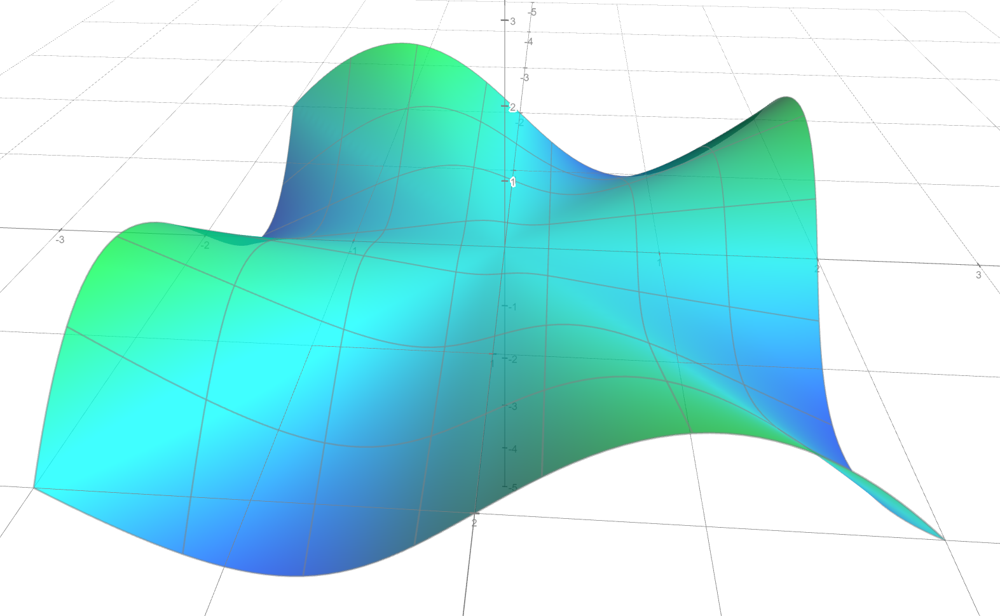

# 一些情况的特例

## 可微但偏导不连续

$$
f(x) = \begin{cases}
xy\sin \frac 1 {\sqrt{x^2+y^2}}, &\text{others}\\
0, &(x, y) = (0, 0)
\end{cases}
$$

基本上是一元函数可导但导函数不连续的二维版本，其在 $x, y$ 轴以外的地方，即 $xy \ne 0$ 时无穷震荡

## 混合偏导不相等

$$
f(x) = \begin{cases}
xy\frac {x^2-y^2}{x^2+y^2}, &\text{others}\\
0, &(x, y) = (0, 0)
\end{cases}
$$

混合偏导 $f''_{12} = f''_{21}$ 相等的条件似乎是混合偏导连续

此例中，$(x, y)\ne (0, 0)$ 时，

$$
\begin{aligned}
f'_1(x, y)
&= y\frac {x^2-y^2}{x^2+y^2} + xy\frac {2x(x^2+y^2) - 2x(x^2 - y^2)}{(x^2+y^2)^2}\\
&= y\frac {x^2-y^2}{x^2+y^2} + \frac {4x^2y^3}{(x^2+y^2)^2}\\
\end{aligned}
$$

且在 $(0, 0)$ 附近趋于 $f'_1(0, 0) = \lim_{x\to 0} 0/x = 0$，故 $f'_1$ 在 $(0, 0)$ 附近连续

求二阶混合偏导:

$$
\begin{aligned}
f''_{12}(x, y)
&= \frac {x^2-y^2}{x^2+y^2} + y \frac {4x^2y^3}{(x^2+y^2)^2} + \frac {12x^2y^2(x^2+y^2) - 4x^2y^32(x^2+y^2)2y} {(x^2+y^2)^4}\\
&=\frac {x^2-y^2}{x^2+y^2} + \frac {4x^2y^4}{(x^2+y^2)^2} + \frac {12x^2y^2(x^2+y^2)^2 - 4x^2y^32(x^2+y^2)2y} {(x^2+y^2)^4}\\
\end{aligned}
$$

将其写为极坐标形式，则上下同阶，$\rho$ 抵消，其值根据 $\theta$ 而变化。当 $(x, y)\to (0, 0)$ 时，其取值取决于 $\theta$，故而不连续。

如果求一下 $f''_{12}(0, 0)$ 会发现 $f''_{12}(0, 0) = \lim_{y\to 0} {-y} {y} = -1$，这仅仅是从 $x$ 轴方向趋近 $(0, 0)$ 时 $f''_{12}(x, y)$ 的取值

## 偏导存在但不可微

$$
f(x) = \begin{cases}
\frac {xy}{\sqrt{x^2+y^2}}, &\text{others}\\
0, &(x, y) = (0, 0)
\end{cases}
$$

