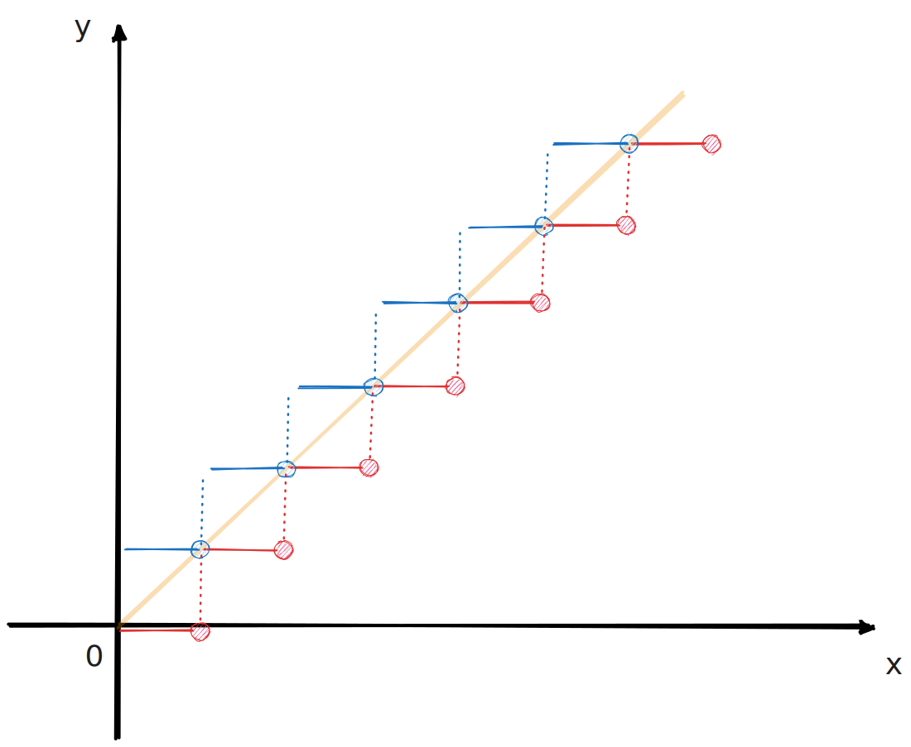

# $\lfloor x\rfloor,\lceil x\rceil$

分段函数想起来都挺麻烦，边界情况容易混淆

$\lfloor x\rfloor$ 这个函数有不等式：

1. $\lfloor x\rfloor < \lfloor x+1\rfloor$
2. $\lfloor x\rfloor \le x$

合起来写作：

$$
... < \lfloor x\rfloor < x < x+1 \le \lfloor x+1\rfloor < x+2 \le ...
$$

同样

1. $\lceil x\rceil < \lceil x+1\rceil$
2. $x < \lceil x\rceil \le x+1$

合起来写作：

$$
... \le x < \lceil x\rceil \le x+1 < \lceil x+1\rceil \le x+2 < ...
$$

实数轴可以看作一段段左闭右开区间 $[0, 1), [1, 2)...$ 粘起来

$\lfloor x\rfloor$ 将 $[n, n+1)$ 映射到 $n$, $\lceil x\rceil$ 将 $[n, n+1)$ 映射到 $n+1$，因此 $\lfloor x\rfloor + 1 = \lceil x \rceil$

合起来写作：

$$
... <x \le \lfloor x\rfloor < x+1 \le \lfloor x+1\rfloor < x+2 \le ...
$$
