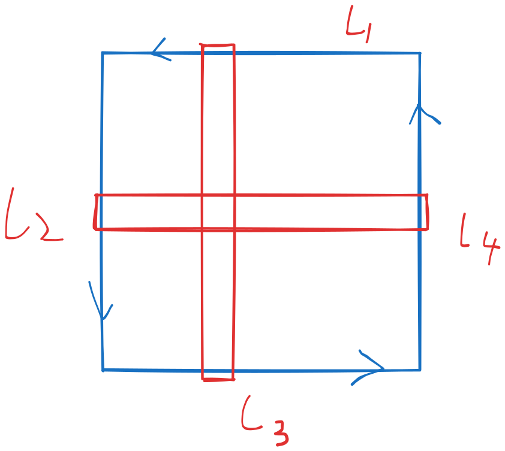

# 格林，高斯，斯托克斯

> [向量写法更好理解](https://www.bilibili.com/video/BV1a5411Y7Jx/?spm_id_from=333.1007.top_right_bar_window_default_collection.content.click&vd_source=5ca25aa1da726043bf719828d09e980f)
> 写法表达很大程度决定了理解难度，好的表达必定更好理解

**格林**：

$$
\oint_{\Sigma} Pdx + Qdy = \oiint_{\Omega} (\frac {\partial Q} {\partial x} - \frac {\partial P} {\partial y})dxdy
$$

**斯托克斯** (三维)：

$$
\oint_{\Sigma} Pdx + Qdy + Rdz =
\oiint_{\Omega}
(\frac {\partial R} {\partial y} - \frac {\partial Q} {\partial z})dydz
+(\frac {\partial P} {\partial z} - \frac {\partial R} {\partial x})dzdx
+(\frac {\partial Q} {\partial x} - \frac {\partial P} {\partial y})dxdy
$$

或写为行列式：

$$
\oint_{\Sigma} Pdx + Qdy + Rdz =
\oiint_{\Omega}
\begin{vmatrix}
    \cos \alpha &
    \cos \beta &
    \cos \gamma\\
    \frac {\partial} {\partial x}&
    \frac {\partial} {\partial y}&
    \frac {\partial} {\partial z}\\
    P& Q& R
\end{vmatrix}
dS
$$

**高斯**（三维）：

$$
\oiint_{\Sigma} Pdydz + Qdzdx + Rdxdy =
\oiiint_{\Omega}
(\frac {\partial P} {\partial x}+
\frac {\partial Q} {\partial y}+
\frac {\partial R} {\partial z})
dv
$$

## 如何评价

上方的高斯散度定理是考研教材写法，其实该写为

$$
\oiint_{\Sigma} Pdy\land dz + Qdz\land dx + Rdx\land dy =
\oiiint_{\Omega}
(\frac {\partial P} {\partial x}+
\frac {\partial Q} {\partial y}+
\frac {\partial R} {\partial z})
dv
$$

或者

$$
\oiint_{\Sigma} (P\cos \alpha + Q\cos \beta + R\cos \gamma)dS =
\oiiint_{\Omega}
(\frac {\partial P} {\partial x}+
\frac {\partial Q} {\partial y}+
\frac {\partial R} {\partial z})
dv
$$

但出题一般是将曲面积分转化为更好求的体积积分，因而神奇的没有影响

## 向量场

其实应该按照向量场写法，更好理解更直观

设向量场

$$
F = (P, Q, R)
$$

场中的有向曲面有单位法向量 $\vec n$

于是封闭曲面有通量 $\oiint_{\Sigma} F\cdot \vec n dS$，引入散度概念（即通量体密度）得

$$
\oiint_{\Sigma} F\cdot \vec n ds = \oiiint_{\Sigma} div Fdv
$$

将通量按照向量场三个方向分解，分别求通量，相加即得总通量

在求分解方向的通量时，利用类似微积分基本原理的方式将 $P$ 转化为了 $\frac {\partial P}{\partial}$，据说这是斯托克斯公式的一维形式，以后再看

对比上式，看出来 $\vec n ds = (dy \land dz, dx \land dz, dx \land dy)$

这与第二个写法相同：$\vec n = (\cos \alpha, \cos \beta, \cos \gamma)$

虽然其实并不懂外微分和楔积，但这里仍能有一个直观认识：$dy \land dz = ds \cos \alpha$

当 $\cos \alpha = 1$ 时，法向量与 $x$ 轴同向，$ds = dy \land dz$

直观上讲很合理，$ds \cos \alpha$ 就该是 $ds$ 在 $yOz$ 平面上的投影

## 二维高斯等价于格林

将高斯定理写为二维，应该是二维平面上的封闭曲线的通量等于封闭趋于内部散度的平面积分：

$$
\oint_{\Sigma} F\cdot \vec n dl = \oiint_{\Omega} div Fds
$$

展开写应该是

$$
\oint_{\Sigma} Pdy - Qdx = \oiint_{\Omega}
(\frac {\partial P} {\partial y} +
\frac {\partial Q} {\partial x})ds
$$

这里将左侧分别投影到两个坐标轴，若投影到 $x$ 轴上，则应该只关心 $F$ 的第一维，即 $P$

因而 $x$ 轴方向的投影通量应为

$$
\oint_{\Sigma} P\cos \alpha dl
$$

众所周知，有向曲线积分里法向量的正向为正向曲线切线顺时针转 $\frac {\pi} {2}$

因此可得

$$
\begin{aligned}
    (\cos \alpha, \cos \beta)
    &=(\cos \alpha, \sin \alpha)\\
    &=(\cos (\alpha + \pi/2 - \pi/2), \sin (\alpha + \pi/2 - \pi/2))\\
    &= (\sin(\alpha + \pi/2) , -\cos(\alpha + \pi/2))\\
    &= (\frac {dy} {dl}, -\frac {dx} {dl})
\end{aligned}
$$

从而

$$
\begin{aligned}
    \oint_{\Sigma} P\cos \alpha dl
    &= \oint_{\Sigma} P dy\\
\end{aligned}
$$

$$
\begin{aligned}
    \oint_{\Sigma} Q\cos \beta dl
    &= \oint_{\Sigma} -Q dx
\end{aligned}
$$

直观上可以将封闭曲线切分为若干简单区域，分别作这些小区域的曲线积分并求和，由于每个小区域的方向相同，故公共边的积分值互相抵消，最终求和只留下原区域的边沿线积分

（实际上可能需要像 wiki 上一样拆成更一般的连通区域，但直接拆成矩形比较方便理解。每个小矩形的积分写出来为：

$$
\begin{aligned}
    \oint_{L_1 + L_2 + L_3 + L_4} P dy
    &= \oint_{L_1 + L_2 + L_3 + L_4} P dy\\
    &= \oint_{L_2 + L_4} P dy\\
\end{aligned}
$$

接下来把有向的曲线积分变为无向的线积分：

$$
\begin{aligned}
    \oint_{L_2 + L_4} P dy
    &= \oint_{L_4} P dy - \oint_{L_2} P dy\\
    &= \oint_{L_4 - L_2} Pdy\\
    &= \oiint_{\Omega} \frac {\partial P} {\partial x} dxdy
\end{aligned}
$$

同理

$$
\begin{aligned}
    \oint_{L_1 + L_3} Q dx
    &= \oint_{L_3} Q dx - \oint_{L_3} Q dx\\
    &= - \oint_{L_1 - L_3} Qdx)\\
    &= - \oiint_{\Omega} \frac {\partial Q} {\partial y}dxdy
\end{aligned}
$$

相减得：

$$
\oint_{\Sigma} Pdy - Qdx = \oiint_{\Omega}
(\frac {\partial P} {\partial y} +
\frac {\partial Q} {\partial x})ds
$$

上面这个推导过程暗示了求通量的过程，可以分别求不同投影方向的通量

于是

$$
\begin{aligned}
    \oint_{\Sigma} F\cdot \vec n dl
    &=\oint_{\Sigma} (P, Q)\cdot (\cos \alpha, \cos \beta) ds\\
    &=\oint_{\Sigma} Pdy - Qdx\\
    &= \oiint_{\Omega}
(\frac {\partial P} {\partial y} +
\frac {\partial Q} {\partial x})ds
\end{aligned}
$$

取 $F = (Q, -P)$，则上述散度定理变为

$$
\oint_{\Sigma} Qdy + Pdx = \oiint_{\Omega}
(\frac {\partial Q} {\partial y} -
\frac {\partial P} {\partial x})ds
$$

即是格林定理

## 斯托克斯
