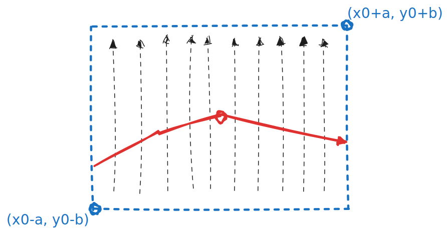

# Jacobi 行列式和隐函数存在定理

## 二元函数隐函数存在定理

这个定理是局部的，邻域的：

> $F(x, y)$ 连续可微，方程 $F(x, y)=0$ 在 $(x_0, y_0)$ 附近满足 $\frac {\partial{F}} {\partial{y}} \ne 0$，则其附近存在一个邻域内能唯一确定一个函数 $y=f(x)$

证明：

由于 $F(x, y)$ 连续可微，则其偏导连续，即 $F_y$ 连续

不妨设 $F_y(x_0, y_0) > 0$，则，直觉上说，其附近能找到一个方块邻域 $[x_0 - a, x_0 + a] \times [y_0 - b, y_0 +b]$，在这块区域里 $F_y(x, y) > 0, F(x_0+a, y) >0, F(x_0 - a, y) < 0$

由于偏导恒正，于是竖向上 $F$ 单增，因而能确定唯一的一条连续曲线使得 $F(x, y) = 0$，该曲线必有 $x$ 能确定一个唯一的 $y$

## 反过来说

反过来说，$\frac {\partial{F}} {\partial{y}} = 0$ 并不一定就不存在唯一隐函数，譬如 $x+y^3=0$， 在 $(0, 0)$ 附近其偏导  $\frac {\partial{F}} {\partial{y}} >= 0$