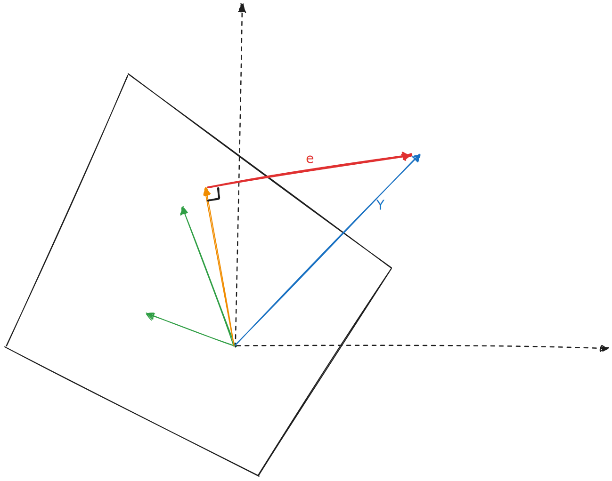

# 最小二乘

## 一维拟合

直线上有 $n$ 个点 $x_n$，在直线上再找一个点 $a$ 来代表这 $n$ 个点，使得误差最小

一般认为就应该找这 $n$ 个点的样本均值了，但为啥呢？取样本均值使得怎样的误差函数取到了最小值呢？

如果定义误差函数为 $f(a) = \Sigma(x_i - a)^2 = \Sigma x_i^2 - 2(\Sigma x_i) a +na^2$，则 $f'(a) = 2na - 2(\Sigma x_i)$

可知此时 $f$ 有最小值 $f(\frac 1 n \Sigma x_i)$

当然，如果从大数定律出发，样本均值自然是一阶期望的无偏估计量

## 直线拟合

```ascii
     ▲
     │                                                       x        ┌────┘
     │                                                           ┌────┘
     │                                                      ┌────┘
     │                                                 ┌────┘
     │               x                            ┌────┘
     │                                       ┌────┘
     │                                  ┌────┘
     │                             ┌────┘                                
     │                        ┌────┘       x                        
     │                   ┌────┘                                
     │              ┌────┘                                
     │         ┌────┘                                                                
     │    ┌────┘                                                                
     ┌────┘         x                                
 ────│                                                                
     │                                                                
     │                                               x               
     │                                                                
─────┼─────────────────────────────────────────────────────────────────────────►
     │
```

找一条直线 $y=ax+b$ 使得直线距离采样的误差最小

此时，最小二乘定义误差为采样点误差的平方和，也即找使得 $f(a, b) = \Sigma (y_i - ax_i - b)^2$ 最小的 $a, b$ 值

如果写为矩阵形式，记

$$Y = \begin{pmatrix}y_1\\y_2\\..\\ y_n\end{pmatrix}, X = \begin{pmatrix}x_1\\ x_2\\ ..\\ x_n\end{pmatrix}, I = \begin{pmatrix}1\\ 1\\ ..\\ 1\end{pmatrix}$$

$$
\begin{matrix}
    1&2
\end{matrix}
$$

则

$$
\begin{aligned}
f(a, b)
&=\Sigma (y_i - ax_i - b)^2\\
&= (Y-aX-bI)^T(Y-aX-bI)\\
&= Y^TY - 2Y^T(aX + bI) + (aX + bI)^T(aX+bI)\\
&= Y^TY - 2Y^TXa - 2Y^TI b + X^TX a^2 + X^TI (2ab) + I^TI b^2\\
\end{aligned}
$$

分别求偏导，得

$$
\begin{cases}
    \frac {\partial f} {\partial a} = - 2Y^TX + X^TX 2a +  X^TI 2b\\
    \frac {\partial f} {\partial b} = - 2Y^TI + X^TI 2a +  I^TI 2b
\end{cases}
$$

二元函数最值，那就先求极值，如果极值存在，肯定偏导为 $0$，解呗：

令两个偏导都等于 $0$，得到线性方程组：

$$
\begin{pmatrix}X^TX & X^TI\\ X^TI & I^TI\end{pmatrix} \begin{pmatrix} a\\b\end{pmatrix} =
\begin{pmatrix}Y^TX \\ Y^TI\end{pmatrix}
$$

这是否...

$$
\begin{pmatrix}X^TX & X^TI\\ X^TI & I^TI\end{pmatrix}=
\begin{pmatrix}X^T\\ I^T\end{pmatrix}
\begin{pmatrix}X& I\end{pmatrix}\\
\begin{pmatrix}Y^TX \\ Y^TI\end{pmatrix} =
\begin{pmatrix}X^T\\ I^T\end{pmatrix}
Y
$$

只能说可以解，但是这也太丑陋了

## 更好的解释

> 来自 [MIT linear algebra course: projection matrix and least square](https://www.bilibili.com/video/BV16Z4y1U7oU?p=16&vd_source=5ca25aa1da726043bf719828d09e980f)

最小二乘的原理在于求解一个拟合结果，使得 $n$ 个误差值 $e_n$ 的平方和 $\Sigma e_i^2$最小

如果将 $n$ 个误差值视为一个 $n$ 维向量 $e =\begin{pmatrix} e_1\\ e_2\\ ..\\ e_n\end{pmatrix}$，那么恰有

$$
\Sigma e_i^2 = ||e||^2
$$

这样一看，求最小值就变成了求最短向量的问题

课中老师举例为三个点 $(1, 1), (2, 2), (3, 2)$

则有 $X = \begin{pmatrix}1\\2\\3\end{pmatrix}, Y = \begin{pmatrix}1\\2\\2\end{pmatrix}$

```ascii
     ▲
     │           
     │           
     │           
     │           
     │           
     │                                                           
    2│                                    x                ┌─x───────┘
     │                                            ┌────────┘
     │                                   ┌────────┘
     │                          ┌────────┘
     │                 ┌────────┘
     │        ┌────────┘   
    1┌────────┘        x                          
 ────│                                                                
     │                                                                
     │                                                               
     │                                                                
─────┼─────────────────────────────────────────────────────────────────────────►
     │                 1                  2                  3        
```

直线拟合时，设直线为 $y=ax+b$，则误差向量为

$$
\begin{aligned}
    e
    &= (aX + b) - Y\\
    &= \begin{pmatrix}
    X & I
\end{pmatrix}\begin{pmatrix}
    a\\ b
\end{pmatrix} - Y\\
&=\begin{pmatrix}
    1&1\\ 2&1\\ 3&1
\end{pmatrix}
\begin{pmatrix}
    a\\ b
\end{pmatrix} - \begin{pmatrix}
    1\\ 2\\ 2
\end{pmatrix}
\end{aligned}
$$

也即，我们要通过选择 $a, b$ 使得 $e$ 最短

思考：这里 $a, b$ 相当于在组合 $(X\ I)$ 的列向量，如果

1. $Y$ 恰好在 $(X\ I)$ 的列空间当中，则误差向量可以取到 $0$，此时显然有最优解（可能不止一个）
2. $Y$ 不在列空间当中（如果列满秩的话，则一定不在列空间里），此时该如何取到最短的误差向量

下图中两个绿色向量 $(1, 2, 3), (1, 1, 1)$ 张成了一个列空间。蓝色向量是 $(1, 2, 2)$

选取 $(a, b)$ 就相当于在列空间上选定了一个橙色向量（两个绿色向量的组合），橙色向量和蓝色向量之差即为误差向量 $e$



此时该如何选取 $(a, b)$ 就变成了一件很显然的事情：$e$ 最短当且仅当选得向量是 $Y$ 在列空间上的投影

求列空间投影不太方便，并非求得 $Y$ 在每个列向量上的投影分量然后相加，而是解一个线性方程组：

$$
\begin{pmatrix}
    1&2&3\\ 1&1&1
\end{pmatrix}
\begin{pmatrix}
    1&1\\ 2&1\\ 3&1
\end{pmatrix}
\begin{pmatrix}
    a\\ b
\end{pmatrix} =
\begin{pmatrix}
    1&1\\ 2&1\\ 3&1
\end{pmatrix}
Y
$$

当 $A = \begin{pmatrix}
    1&1\\ 2&1\\ 3&1
\end{pmatrix}$ 列满秩时，$A^TA$ 显然是可逆的，于是可以解得 $(a, b)$

## 一维兼容

$$
e = \begin{pmatrix}
    1\\ 1\\ 1
\end{pmatrix} \bar{x} - X
$$

同样的可以以投影来解释

## 更高维度

同理
