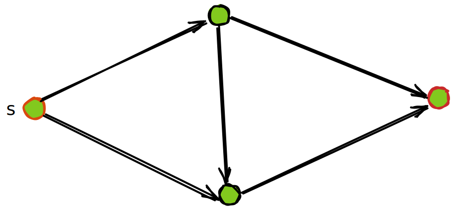
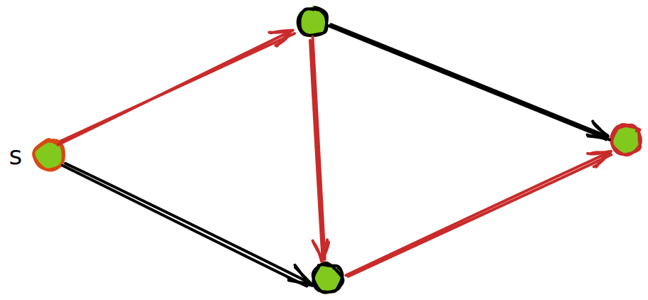
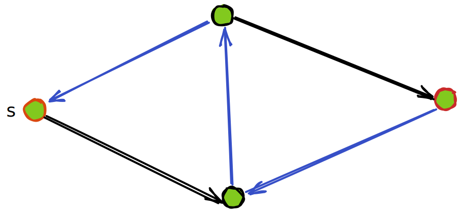
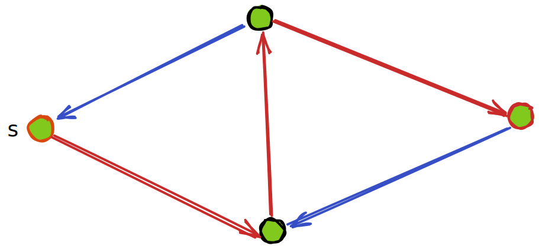
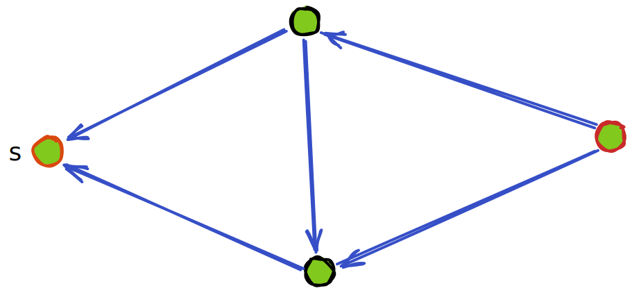
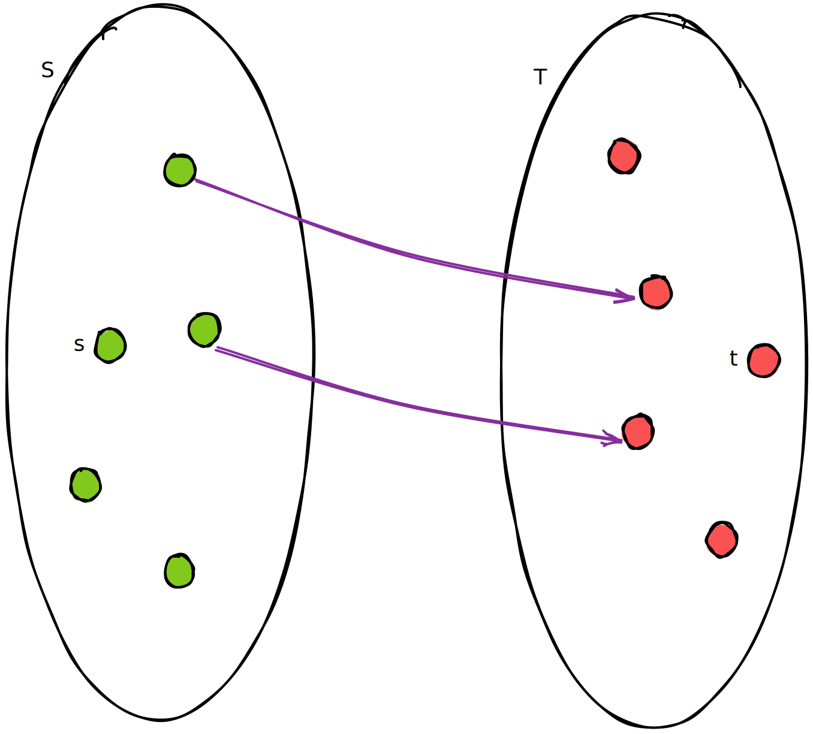
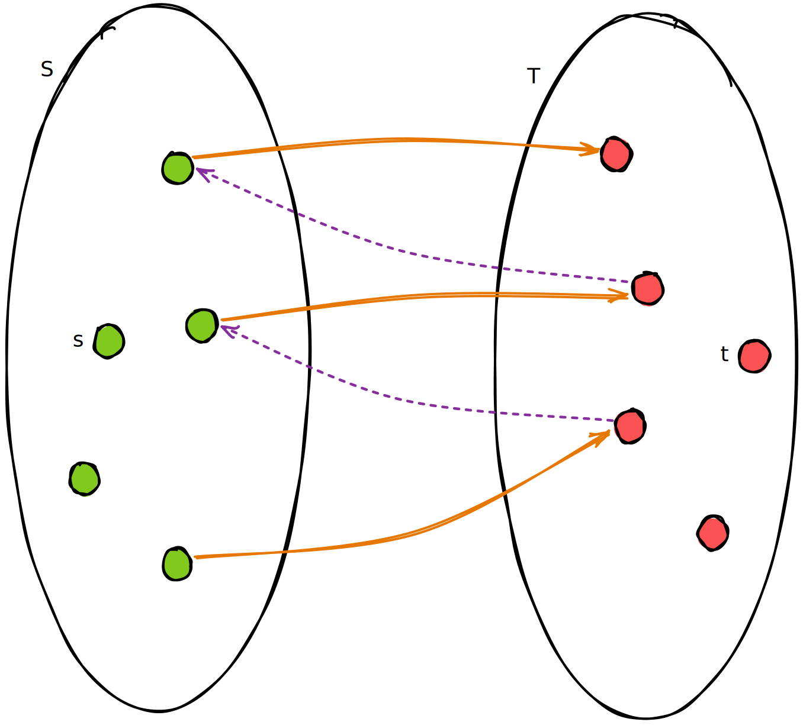
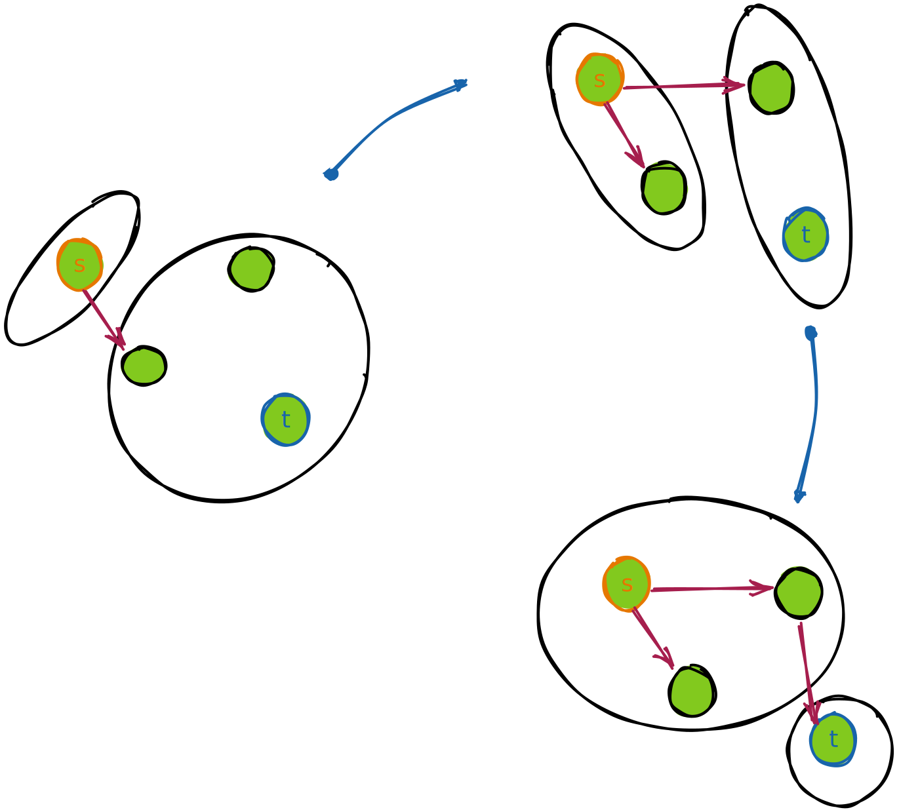
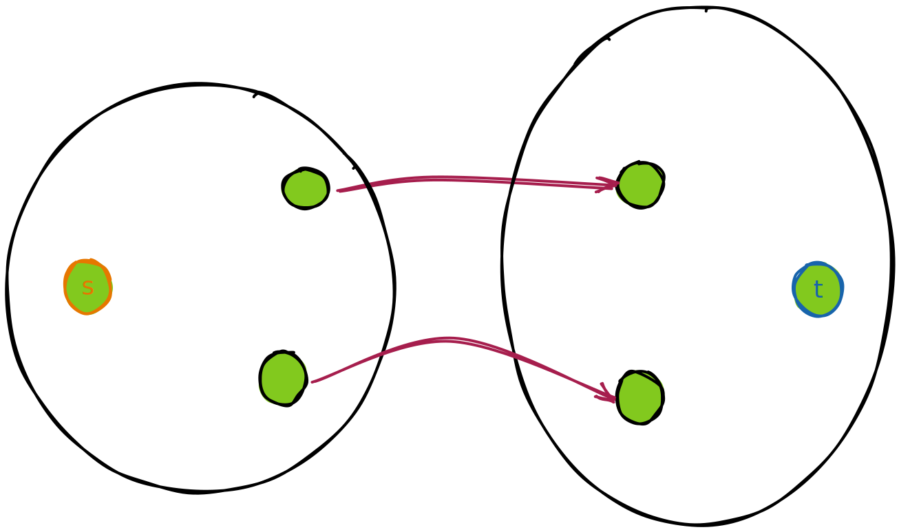

# minimum cut maximum flow

> [jyy老师的图解画的真好](https://www.bilibili.com/video/BV1Q7411R7ie/)

## 罗列定义

### 网络流

a ***flow network*** is a directed graph $G=(V, E)$ without multiple arcs, where each edge has a non-negative ***capacity*** function $c$ and each edge receives a flow.

if 2 nodes are distinguished -- one as the ***source*** $s$, and the other as the ***sink*** $t$, then $(G, c, s, t)$ is called a network flow.

### 流

$f: V\times V \to \R$，$f(u, v)$ 表示从 $u$ 到 $v$ 的流。其应该满足

1. *Skew symmetric constraint*. $f(u, v) = -f(v, u)$，符号表示方向。这说明以邻接矩阵表示该图，则该矩阵斜对称
2. *Capacity constraint*. An arc's flow cannot exceed its capacity. that is $f(u, v) \le c(u, v)$

以上两条定义了 ***pseudo-flow***（不知道中文叫什么，伪流吗？）

再加上第三条约束则定义了 ***feasible flow***, or just a ***flow***:

3. *Flow conservation constraint*, 流量守恒，除了 $s, t$ 之外，其余节点都应满足输入等于输出

### 割

a ***Cut*** $C = (S, T)$ is the set $\{(u, v) \in E \ | \ u \in S, v \in T\}$

也就是割只关心从 $S$ 到 $T$ 的边，反方向的边是不关注的。

the ***capacity*** of an *s-t cut* is defined as the sum of the capacity of each edge in the cut-set.

### 残量网络

添加一个流之后网络剩下的容量视为一个新网络. $c_f(u, v) = c(u, v) - f(u, v)$

### 增广路径

即找一条从 $s$ 到 $t$ 的路径。

注意流函数 $f$ 可以为负数，$f(u, v) < 0$ 说明 $f(v, u) > 0$，从 $f(u, v) = - f(v, u)$ 和 $0 \le f(v, u) \le c(v, u)$ 的约束中可以得到 $$-c(v, u) \le f(u, v) \le 0$$

这描述了 $f(u, v)$ 的合法范围，这个流可以看作在容量为 $[-c(v, u), 0]$ 的管道中流动

每一条新的流量为 $k$ 的增广路径 $P$ 都不过是在 $P$ 上每一条边加上一点流量 $k$。只要 $k + f(u, v) \le 0$，这条路径就是合法的。

## Ford-Fulkerson 增广

我记得之前看的资料都把这个算法描述为增广的同时添加一条反向边

jyy 老师的讲解中增加了一个图解：

如果把流经一个割两侧的流量之和称为这个割的流量，那么对每一个割来说，每一次增广都一定会增大这个割的流量

- 问: 一个网络流的任意的割都有相同流量吗？

- 答: 是的。这是显然的，因为一个割把网络流图分割为两部分，而所有从 $s$ 出发的流一定会流到 $t$，因此任意的割的流量都是相等的

虽然割的流量都是相等的，但是割的容量不一定是相等的，它取决于这个割有哪些边

每次增广后，都考虑残差网络的割

- 问: 若一个网络所有割的容量都大于 $0$，则一定可以增广吗？
- 答: 是的。这个过程很好想象，画图如下：

这个过程中有一个小细节：每一次连接割中两个点 $u, v$，$u$ 并不总是上一次连接进去的点

然而，可以归纳地保证，每一次新连进去的点 $v$，必有一条从 $s$ 到 $v$ 的增广路径

因而每一次新取的割中 $S$ 里的每一个点都能从 $s$ 出发走到

因此，在增广过程的最后连接 $t$，这保证了有一条从 $s$ 到 $t$ 的路径

## 最大流最小割定理

上面说明了若一个网络所有割的容量都大于 $0$，则一定可以增广

因此，通过不断的增广，最终会使得残差网络中的所有割当中，至少有一个割，容量为 $0$

显然，按此割来分割原网络流：

不可能有更大的流了，因而得到了最大流

同时，显然不可能有比它容量更小的割

## 总结

这么看下来好像也没有特别难以理解的地方，可能还是没有做题，检验不出来

如果能很自然地接受负数流，进而理解增广路径的过程，那么接下来就一路平坦了
