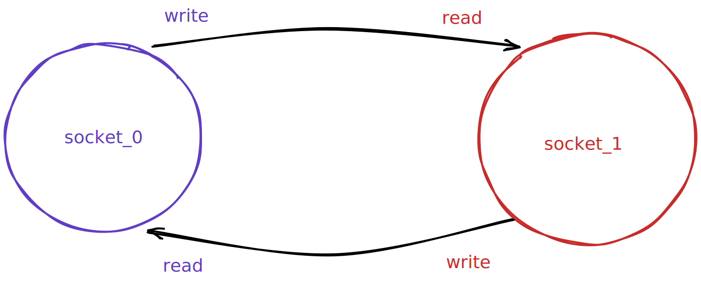

# peek

lab0 的第一部分是模仿 `telnet` 的操作，用它给的 `socket` 实现去进行一个 `http` 的 `GET` 请求



每个 `socket` 都在 `write` 对面和 `read` 自己，这与后面实现的 `StreamBytes` 类不同

## `ByteStream`

第二部分

按照要求，这是一个单线程读写 `Stream`

也就是说，同时只有一个 `writer` 和一个 `reader`，而且 `reader` 读的还都是这个 `writer` 写的东西

这部分的主要问题在于 `peek` 函数

```cpp
class Reader : public ByteStream
{
public:
  std::string_view peek() const; // Peek at the next bytes in the buffer
```

函数是 `const` 的，说明没有副作用

返回值类型是 `string_view`，这是一个引用，相当于 `slice`

这说明该函数应该返回自己内部数据的一个引用类型

然而 `string_view` 要求引用的数据是 `contiguous` 的，也就是说在内存里要挨着

如果我来定义这个 `peek` 我估计会返回一个迭代器

总之这样就只能用 `vector` 了，并且用它模拟一个环

然而新问题在于 `peek` 需要能返回多长的内容

如果返回迭代器就没有这个问题，但返回 `string_view` 代表返回的内容长度需要我来决定

额

既然用 `vector` 模拟环了，那么能返回的长度上限就不是 `capacity`，而是从 `head` 到 `vector.end()` 之间，这样会导致 `peek` 不能保证 `peek` 到全部内容

...

然而这么写的话，测试都过了

不好说

在不 `pop` 的情况下，明显会出现有一部分内容永远无法 `peek` 到的情况


这应该不是一个好的定义

## `vector` 模拟环

我计算下标的时候直接储存了单调递增的 `head` 和 `tail`，虽然是 `uint64` 类型，但终究是有限数

...

不好说，感觉问题很大
